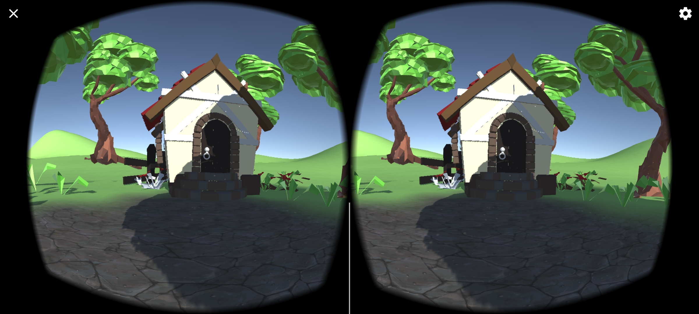

# unity-ar-first-project
This was my first unity project!
You can download the apk from release. Move your screen to around to look. There isnt much but some trees, pathway and a house. 3d modelled the house and pathway in blender and exported it to unity. You can move forward by tilting the phone screen.

## Screenshots
 
 
 
